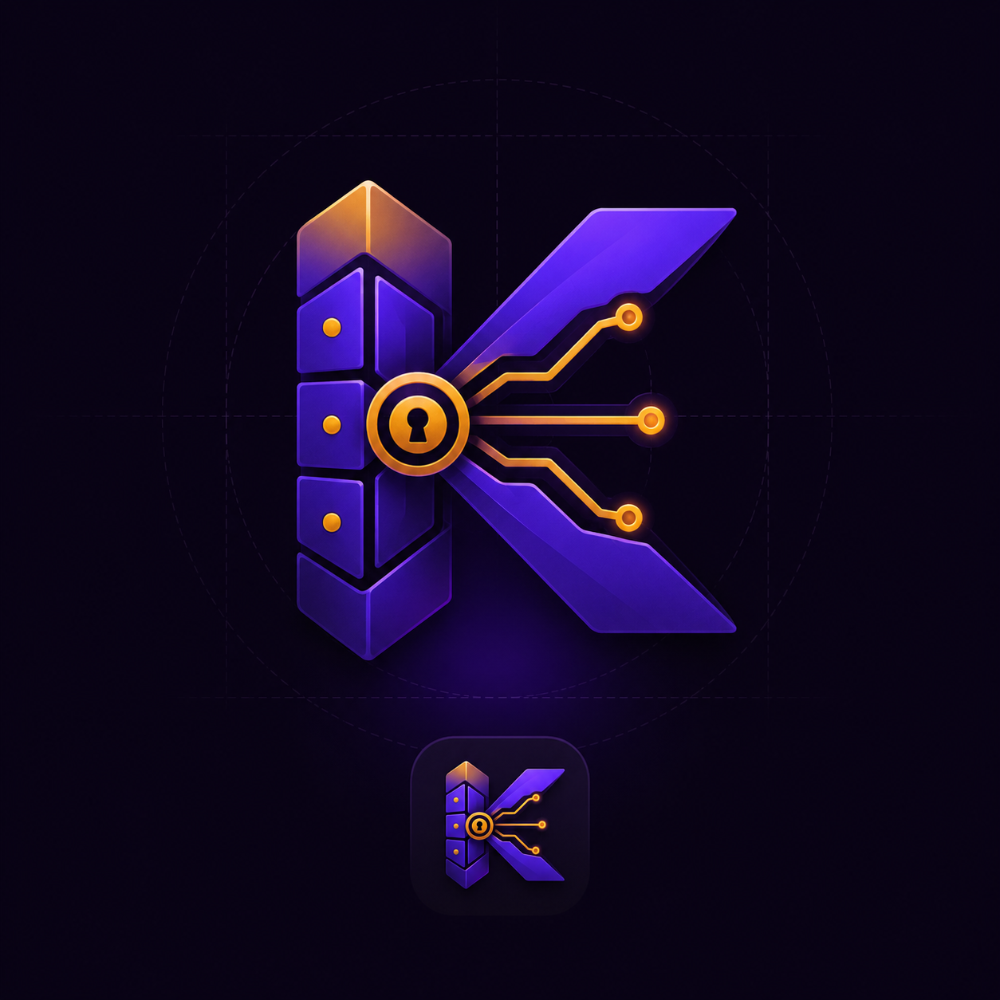

<p align="center">
  
</p>

<h1 align="center">kosha-discovery — कोश</h1>

<p align="center"><strong>AI Model & Provider Discovery Registry</strong></p>

<p align="center">
  <a href="https://www.npmjs.com/package/@sriinnu/kosha-discovery"></a>
  <a href="https://www.npmjs.com/package/@sriinnu/kosha-discovery"></a>
  <a href="https://github.com/sriinnu/kosha-discovery/blob/main/LICENSE"></a>
  <a href="https://www.npmjs.com/package/@sriinnu/kosha-discovery"></a>
</p>

Kosha (कोश — *treasury*) discovers AI models across providers, resolves credentials, enriches with pricing, and exposes the catalog through a library, CLI, HTTP API, and a built-in OpenAI-compatible proxy. One source of truth for model identity, pricing, and routing — so your app doesn't break when providers ship new SKUs or change rates.

## Install

```bash
npm install @sriinnu/kosha-discovery       # library / server
npm install -g @sriinnu/kosha-discovery    # global `kosha` CLI
```

## Quick start

### Library

```typescript
import { createKosha } from "@sriinnu/kosha-discovery";

const kosha = await createKosha();

const models    = kosha.models();                          // all
const cheapest  = kosha.cheapestModels({ role: "image" }); // ranked
const sonnet    = kosha.model("sonnet");                   // alias resolves
console.log(sonnet.pricing); // { inputPerMillion: 3, outputPerMillion: 15, ... }
```

### CLI

```bash
kosha discover                       # discover all providers (writes cache + manifest)
kosha list --provider anthropic      # filter from local cache
kosha model sonnet                   # details for one model (alias-aware)
kosha cheapest --role embeddings     # rank cheapest for a role
kosha update                         # force a fresh fetch
kosha serve --port 3000              # HTTP API
```

After each discovery, a stable v1 manifest lands at `~/.kosha/registry.json` — any tool that reads JSON can consume it:

```bash
jq '.models[] | select(.pricing.inputPerMillion < 0.1) | .modelId' ~/.kosha/registry.json
```

### HTTP API

```
GET  /api/models[?provider=…&role=…]    GET  /api/models/:idOrAlias
GET  /api/models/:idOrAlias/routes      GET  /api/models/cheapest?role=…
GET  /api/providers                     GET  /api/roles
POST /api/refresh                       GET  /health
```

### Proxy

Kosha runs as an OpenAI-compatible proxy. Point your SDK at `http://localhost:3000/proxy/v1` and it resolves the model, picks the right provider, injects credentials, and forwards — streaming included.

```bash
kosha serve   # start on :3000
```

```typescript
import OpenAI from "openai";

const client = new OpenAI({
  baseURL: "http://localhost:3000/proxy/v1",
  apiKey:  "not-used",   // kosha resolves credentials from env
});

// Use any canonical model ID or alias
const res = await client.chat.completions.create({
  model: "sonnet",
  messages: [{ role: "user", content: "hello" }],
});

// Let kosha pick the cheapest model you have a key for
const cheap = await client.chat.completions.create({
  model: "kosha:cheapest",
  messages: [{ role: "user", content: "hello" }],
});

// Cheapest model with tool_use and at least 128k context
const routed = await client.chat.completions.create({
  model: "kosha:cheapest[tool_use,128k]",
  messages: [{ role: "user", content: "hello" }],
});
```

**`kosha:cheapest` filter syntax** (comma-separated, combinable):

| Filter | Example | Meaning |
|--------|---------|---------|
| capability | `tool_use`, `vision` | model must have this tag |
| `<N>k` | `128k`, `200k` | minimum context window |
| `provider:<id>` | `provider:groq` | pin to a specific provider |

The response always includes `x-kosha-model`, `x-kosha-provider`, and `x-kosha-requested` headers so the caller knows exactly what ran.

Supported transports: `openai`, `openai-compatible-http`, `ollama`. Anthropic, Google, Bedrock, and Vertex require wire-format translation — not yet proxied.

## Supported providers

| Provider | Discovery | Credential sources |
|----------|-----------|--------------------|
| Anthropic | `/v1/models` | `ANTHROPIC_API_KEY`, Claude CLI, Codex CLI |
| OpenAI | `/v1/models` | `OPENAI_API_KEY`, GitHub Copilot tokens |
| Google | `/v1beta/models` | `GOOGLE_API_KEY`, `GEMINI_API_KEY`, Gemini CLI, gcloud |
| AWS Bedrock | SDK → CLI → static | `AWS_ACCESS_KEY_ID`, `~/.aws/credentials`, SSO, IAM |
| Vertex AI | API + gcloud | `GOOGLE_APPLICATION_CREDENTIALS`, ADC |
| Ollama | local API | — (local) |
| OpenRouter | API | `OPENROUTER_API_KEY` *(optional)* |
| Vercel AI Gateway | `/v1/models` | `AI_GATEWAY_API_KEY`, `VERCEL_OIDC_TOKEN` *(public discovery, required for execution)* |
| NVIDIA / Together / Fireworks / Groq / Cerebras / Cohere / DeepInfra / Perplexity | API | provider key env var |
| DeepSeek / Mistral / Moonshot (Kimi) / GLM (Zhipu) / Z.AI / MiniMax | API | provider key env var |

Full credential setup: [docs/credentials.md](docs/credentials.md).

## Architecture

<p align="center">
  
</p>

Discovery layer talks to provider APIs and local catalogs. Enrichment layer fills pricing and context windows from the LiteLLM catalog and models.dev. Resilience layer (circuit breaker + stale-cache fallback + health tracker) keeps a flaky provider a degraded read, never a crash. Manifest layer writes a v1-stable JSON snapshot so downstream consumers — `tokmeter`, `chitragupta`, `ayuh` — read prices from one source instead of inventing their own. Proxy layer exposes an OpenAI-compatible endpoint that resolves `kosha:cheapest[…]` hints at request time, injects credentials, and forwards to the winning provider.

## Docs

| | |
|---|---|
| [Credentials](docs/credentials.md) | Env vars, CLI tools, and config files for every provider |
| [CLI](docs/cli.md) | Commands, flags, examples |
| [HTTP API](docs/api.md) | Endpoints, parameters, response schemas |
| [Configuration](docs/configuration.md) | Aliases, routing, enrichment, programmatic config |
| [Architecture](docs/architecture.md) | Discovery flow, module map, adding providers |
| [Resilience](docs/resilience.md) | Circuit breakers, stale cache, health |
| [Security](docs/security.md) | Threat catalogue, runtime scanning, pre-commit hook |
| [Discovery Plane v1](docs/discovery-plane-v1.md) | Stable daemon contract (deltas, SSE watch, binding hints) |

## Release

Tag-driven via GitHub Actions:

```bash
git tag -s vX.Y.Z -m "vX.Y.Z" && git push origin vX.Y.Z
# → Actions → "Manual Release (Tag + npm)" → run with tag=vX.Y.Z
```

The workflow checks tag ↔ package.json match, builds, tests, publishes to npm, and creates the GitHub Release. Requires the `NPM_TOKEN` secret.

## Credits

[litellm](https://github.com/BerriAI/litellm) (pricing data) · [openrouter](https://openrouter.ai) · [ollama](https://ollama.ai) · [chitragupta](https://github.com/sriinnu/chitragupta) (registry patterns) · [takumi](https://github.com/sriinnu/takumi) (routing needs that drove kosha's creation).

## License

MIT
