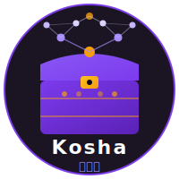
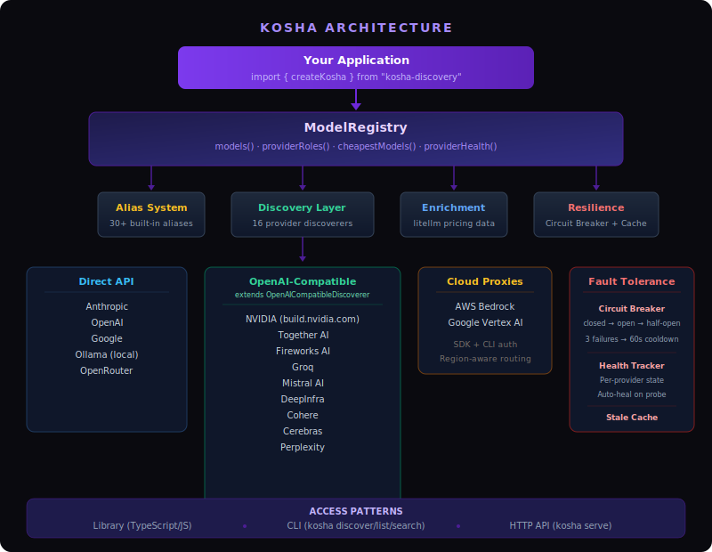

<p align="center">
  
</p>

<h1 align="center">kosha-discovery — कोश</h1>

<p align="center"><strong>AI Model & Provider Discovery Registry</strong></p>

<p align="center">
  <a href="https://www.npmjs.com/package/kosha-discovery"></a>
  <a href="https://github.com/sriinnu/kosha-discovery/blob/main/LICENSE"></a>
  
</p>

Kosha (कोश — treasury/repository) automatically discovers AI models across providers, resolves credentials from CLI tools and environment variables, enriches models with pricing data, and exposes the catalog via library, CLI, and HTTP API.

## Why

AI applications hardcode model IDs, pricing, and provider configs. When providers add models or change pricing, every app breaks. Kosha solves this:

- **Dynamic discovery** — fetches real model lists from provider APIs
- **Smart credentials** — finds API keys from env vars, CLI tools (Claude, Copilot, Gemini CLI), and config files
- **Pricing enrichment** — fills in costs and context windows from litellm's community-maintained dataset
- **Model aliases** — `sonnet` → `claude-sonnet-4-20250514`, updated as models evolve
- **Role matrix** — query provider -> model -> roles (`chat`, `embedding`, `image_generation`, etc.)
- **Cheapest routing** — rank cheapest eligible models for tasks like embeddings or image generation
- **Local LLM scanning** — detects Ollama models alongside cloud providers
- **Three access patterns** — use as a library, CLI tool, or HTTP API

## Install

```bash
pnpm add kosha-discovery
```

## Development (pnpm)

```bash
pnpm install
pnpm run build
pnpm run test
```

## Quick Start

### Library

```typescript
import { createKosha } from "kosha-discovery";

const kosha = await createKosha();

const models = kosha.models();                           // all models
const embeddings = kosha.models({ mode: "embedding" });  // filter by mode
const model = kosha.model("sonnet");                     // resolve alias
const cheapest = kosha.cheapestModels({ role: "image", limit: 3 });

console.log(model.pricing); // { inputPerMillion: 3, outputPerMillion: 15, ... }
```

### CLI

```bash
kosha discover                          # discover all providers
kosha list                              # list models
kosha list --provider anthropic         # filter by provider
kosha search gemini                     # fuzzy search
kosha model sonnet                      # model details
kosha cheapest --role embeddings        # cheapest for a task
kosha routes gpt-4o                     # all provider routes
kosha providers                         # provider status
kosha latest                            # force-fetch latest provider/model details
kosha latest --provider openai          # latest for one provider
kosha serve --port 3000                 # start HTTP API
```

### Auto-Fetch JSON Snapshot

```bash
# one-shot latest snapshot
pnpm run autofetch:once

# custom output/provider
pnpm run autofetch:once -- --provider openai --output ./data/openai-latest.json

# continuous loop (default 3600s)
pnpm run autofetch -- --interval-seconds 900
```

By default this writes JSON to `./data/kosha-latest.json`.

### CI / Smoke Checks

Workflow files:

- `.github/workflows/update-kosha-snapshot.yml`
- `.github/workflows/provider-smoke.yml`

Snapshot workflow:

- Scheduled: weekly (Monday 06:00 UTC)
- Manual: GitHub UI -> Actions -> `Update Kosha Snapshot` -> `Run workflow`
- Optional manual inputs:
  - `provider` (empty = all providers)
  - `output` (default `data/kosha-latest.json`)
- Disable scheduled runs without removing the workflow by setting `KOSHA_SNAPSHOT_SCHEDULE_ENABLED=false`
- Manual `Run workflow` still works even when schedule is disabled

Provider smoke workflow:

- Scheduled: nightly (03:00 UTC)
- Manual: GitHub UI -> Actions -> `Provider Smoke Checks` -> `Run workflow`
- Runs only when repository variable `KOSHA_PROVIDER_SMOKE_ENABLED=true`
- Manual dispatch can override that gate with `force=true`
- Installs with pnpm, builds, then runs a node inline smoke script against real provider endpoints
- Providers without the required secrets are skipped instead of failing the job
- Always uploads `artifacts/provider-smoke-report.json`

Provider smoke secrets:

- OpenAI: `OPENAI_API_KEY`
- Google/Gemini: `GOOGLE_API_KEY` or `GEMINI_API_KEY`
- Mistral: `MISTRAL_API_KEY`
- DeepSeek: `DEEPSEEK_API_KEY`
- Moonshot: `MOONSHOT_API_KEY` or `KIMI_API_KEY`
- GLM: `GLM_API_KEY` or `ZHIPUAI_API_KEY`
- Z.AI: `ZAI_API_KEY`
- MiniMax: `MINIMAX_API_KEY`
- OpenRouter: optional `OPENROUTER_API_KEY`
- Bedrock: `AWS_ACCESS_KEY_ID`, `AWS_SECRET_ACCESS_KEY`, `AWS_DEFAULT_REGION`
- Vertex AI: `GOOGLE_APPLICATION_CREDENTIALS_JSON`, `GOOGLE_CLOUD_PROJECT`

Security controls in these workflows:

- Snapshot workflow commits only the configured snapshot file path plus its checksum file, never broad `git add -A`
- Snapshot workflow validates the generated snapshot against a local JSON schema before commit
- Snapshot workflow runs a high-signal secret-pattern scan on snapshot output before commit
- Snapshot workflow writes `data/kosha-latest.sha256` alongside the snapshot
- Snapshot workflow uploads an always-on artifact with run metadata, provider summaries, and failure details
- Provider smoke workflow never echoes secret values and records a machine-readable JSON report

### Branch Protection Audit

Workflow file: `.github/workflows/branch-protection-check.yml`

- Runs on `main` and via `workflow_dispatch`
- Reads the `main` branch protection rule through the GitHub API
- Expects the required status checks list to include `Branch Protection Check / audit`
- Uploads a warning artifact instead of failing when the token cannot read branch protection settings

Keep that check name stable when you rename the workflow or job, and update the protection rule whenever you add more required checks.

### Where Data Is Stored

- Git repo: model/provider discovery data is **not** committed by default.
- Runtime cache: `~/.kosha/cache/*.json` (machine-local, TTL-based).
- Exported snapshot: only if you run `autofetch`/`autofetch:once` with an output file and commit it yourself.

### HTTP API

```bash
kosha serve --port 3000
```

```
GET /api/models                    — All models (filterable)
GET /api/models/cheapest           — Cheapest ranked models
GET /api/models/:idOrAlias         — Single model
GET /api/models/:idOrAlias/routes  — All provider routes
GET /api/roles                     — Provider → model → roles matrix
GET /api/providers                 — All providers
POST /api/refresh                  — Re-discover
GET /health                        — Health check
```

## Supported Providers

| Provider | Discovery | Credential Sources |
|----------|-----------|-------------------|
| Anthropic | API (`/v1/models`) | `ANTHROPIC_API_KEY`, Claude CLI, Codex CLI |
| OpenAI | API (`/v1/models`) | `OPENAI_API_KEY`, GitHub Copilot tokens |
| Google | API (`/v1beta/models`) | `GOOGLE_API_KEY`, `GEMINI_API_KEY`, Gemini CLI, gcloud |
| AWS Bedrock | SDK → CLI → static | `AWS_ACCESS_KEY_ID`, `~/.aws/credentials`, SSO, IAM |
| Vertex AI | API + gcloud | `GOOGLE_APPLICATION_CREDENTIALS`, gcloud ADC |
| Ollama | Local API | None needed (local) |
| OpenRouter | API | `OPENROUTER_API_KEY` (optional) |
| NVIDIA | API | `NVIDIA_API_KEY` |
| Together AI | API | `TOGETHER_API_KEY` |
| Fireworks AI | API | `FIREWORKS_API_KEY` |
| Groq | API | `GROQ_API_KEY` |
| Mistral AI | API | `MISTRAL_API_KEY` |
| DeepInfra | API | `DEEPINFRA_API_KEY` |
| Cohere | API | `CO_API_KEY` |
| Cerebras | API | `CEREBRAS_API_KEY` |
| Perplexity | API | `PERPLEXITY_API_KEY` |
| DeepSeek | API | `DEEPSEEK_API_KEY` |
| Moonshot (Kimi) | API | `MOONSHOT_API_KEY` / `KIMI_API_KEY` |
| GLM (Zhipu) | API | `GLM_API_KEY` / `ZHIPUAI_API_KEY` |
| Z.AI | API | `ZAI_API_KEY` |
| MiniMax | API | `MINIMAX_API_KEY` |

## Security

All external data (API responses, CLI output, cache reads) is scanned for 9 threat types before use: credential leaks, base64 payloads, script/shell injection, data URIs, null bytes, prototype pollution, hex blobs, and oversized strings. A pre-commit hook blocks secrets at commit time.

See [docs/security.md](docs/security.md) for the full threat catalogue and architecture.

## Architecture

<p align="center">
  
</p>

```
┌─────────────────────────────────────────────────────┐
│                  Your Application                    │
│        import { createKosha } from "kosha"          │
└───────────────────────┬─────────────────────────────┘
                        │
┌───────────────────────▼─────────────────────────────┐
│                  ModelRegistry                        │
│  models() · providerRoles() · cheapestModels()       │
└──┬──────────┬──────────────┬───────────────┬────────┘
   │          │              │               │
┌──▼───┐ ┌───▼────────┐ ┌───▼──────────┐ ┌──▼─────────┐
│Alias │ │ Discovery   │ │ Enrichment   │ │ Resilience  │
│System│ │ Layer       │ │ Layer        │ │ Layer       │
└──────┘ └───┬────────┘ └──────┬───────┘ └────────────┘
             │                 │          CircuitBreaker
    ┌────────┼────────┐        │          HealthTracker
    ▼        ▼        ▼        ▼          StaleCachePolicy
 Direct   OpenAI-   Cloud      litellm
  API    Compatible  Proxies    JSON
```

## Documentation

| Doc | What's in it |
|-----|-------------|
| [Credentials](docs/credentials.md) | Setup for all 16 providers (env vars, CLI tools, config files) |
| [CLI Reference](docs/cli.md) | All commands, flags, and example output |
| [HTTP API](docs/api.md) | All endpoints, parameters, and response schemas |
| [Configuration](docs/configuration.md) | Aliases, routing, pricing enrichment, programmatic config |
| [Architecture](docs/architecture.md) | Discovery flow, module map, data pipeline, adding providers |
| [Resilience](docs/resilience.md) | Circuit breakers, stale cache fallback, health monitoring |
| [Security](docs/security.md) | Threat catalogue, runtime scanning, pre-commit hook |
| [Discovery Plane v1](docs/discovery-plane-v1.md) | Stable daemon contract (deltas, SSE watch, binding hints) |

## Credits

- **[litellm](https://github.com/BerriAI/litellm)** -- Community-maintained model pricing database
- **[openrouter](https://openrouter.ai)** -- Model aggregation API
- **[ollama](https://ollama.ai)** -- Local LLM runtime
- **[chitragupta](https://github.com/sriinnu/chitragupta)** -- Autonomous AI Agent Platform whose registry patterns inspired kosha
- **[takumi](https://github.com/sriinnu/takumi)** -- AI coding agent TUI whose routing needs drove kosha's creation

## What "Kosha" Means

`Kosha` comes from Sanskrit -- a container, treasury, or layered sheath of knowledge. A standalone model-discovery utility for any AI system.

## License

MIT
